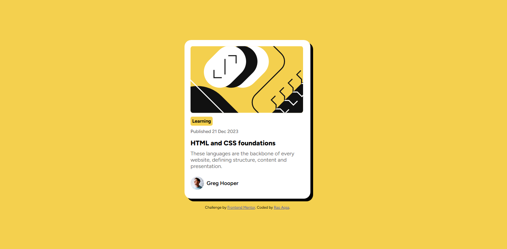

# Frontend Mentor - Blog preview card solution

This is a solution to the [Blog preview card challenge on Frontend Mentor] 

## Table of contents

- [Overview](#overview)
  - [The challenge](#the-challenge)
  - [Screenshot](#screenshot)
  - [Links](#links)
  - [Built with](#built-with)
  - [What I learned](#what-i-learned)
- [Author](#author)

## Overview

A responsive Blog Preview Card built as a Frontend Mentor challenge.

### The challenge

Users should be able to:

- See hover and focus states for all interactive elements on the page

### Screenshot

### Links

- Solution URL: (https://github.com/Rao-Aqsa/blog-preview-card)
- Live Site URL: (https://rao-aqsa.github.io/blog-preview-card/)

### Built with

- Semantic HTML5 markup
- CSS custom properties
- Flexbox
- Responsive design
- Google Fonts (Figtree)

### What I learned

I learned how to center a card using Flexbox and how `min-height: 100vh` 
helps in vertical alignment. I also practiced using Google Fonts and 
improved my understanding of responsive card layouts.

## Author

- Frontend Mentor - [@yourusername](https://www.frontendmentor.io/profile/yourusername)

